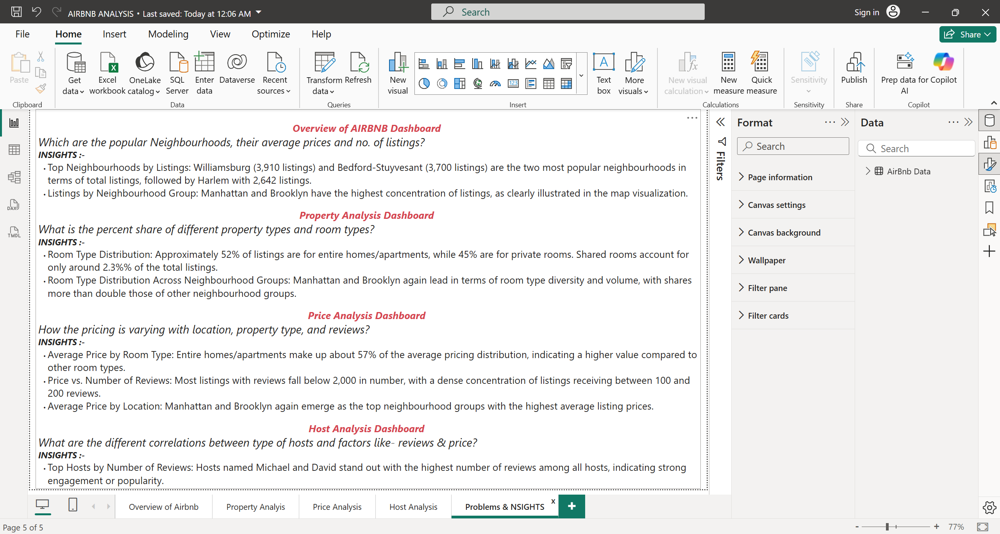

## Airbnb Power BI Dashboard – README
# 📌 Project Overview
This Power BI project provides a detailed analysis of Airbnb listings to uncover patterns in market presence, property types, pricing, and host behavior. Interactive visualizations help users explore data dynamically across various dimensions such as location, room type, and host profiles.

The dashboard is structured into four analytical themes: Overview, Property Analysis, Pricing Analysis, and Host Analysis, enabling a holistic understanding of Airbnb’s operational landscape.

# 📁 Dashboard Structure

The report is divided into four key analytical themes:

1. **Overview AIRBNB**
2. **Property Analysis**
3. **Pricing Analysis**
4. **Host Analysis**

## 📊 Airbnb Data Visualization Project - Summary :

# **Overview AIRBNB Dashboard:-**  
This section provides a high-level snapshot of Airbnb listings to understand the market size and activity.

Total Listings, Total Hosts, Average Price, Total Reviews (KPIs): These key performance indicators offer quick insight into the scale of Airbnb operations and average pricing trends.

Popular Neighbourhoods (Bar Chart): Highlights which neighbourhoods attract the most listings, showing demand and concentration of Airbnb properties.

Listings by Neighbourhood Groups / Neighbourhood (Map): Visualizes the geographic spread of listings across broader neighbourhood groups and specific neighbourhoods, helping to locate hotspots.

## **Overview Insights:-**

Top Neighbourhoods by Listings:
Williamsburg (3,910 listings) and Bedford-Stuyvesant (3,700 listings) are the two most popular neighbourhoods in terms of total listings, followed by Harlem with 2,642 listings.

Listings by Neighbourhood Group:
Manhattan and Brooklyn have the highest concentration of listings, as clearly illustrated in the map visualization.

# **Property Analysis Dashboard:-**
This section dives into the types of properties and rooms available, revealing the structure of Airbnb's offerings.

Percentage Share of Room Types (Pie Chart): Shows the proportion of listings by room type, such as entire homes, private rooms, and shared rooms, revealing market composition.

Share of Different Room Types Across Neighbourhoods (Column Chart): Breaks down room type distribution by neighbourhood to identify area-specific preferences or trends.

## **Property Analysis Insights:-**

Room Type Distribution:
Approximately 25% of listings are for entire homes/apartments, while 22% are for private rooms. Shared rooms account for only around 1% of the total listings.

Room Type Distribution Across Neighbourhood Groups:
Manhattan and Brooklyn again lead in terms of room type diversity and volume, with shares more than double those of other neighbourhood groups.

# **Pricing Analysis Dashboard:-**
This section explores how prices vary across different factors to understand pricing dynamics.

Average Price by Neighbourhood Group & Room Type (Column Chart): Demonstrates how location and room type affect average pricing, highlighting premium or budget areas and room types.

Average Price by Room Type (Donut Chart): Focuses on price differences purely by room type across the dataset.

Price vs. Number of Reviews (Scatter Plot): Examines the relationship between listing popularity (reviews) and pricing, which may indicate whether higher-priced listings receive more or fewer reviews.

Geographical Price Distribution (Map): Shows price variation spatially, revealing geographic pricing patterns or clusters of expensive vs. affordable listings.

## **Price Analysis Insights:-**

Average Price by Room Type:
Entire homes/apartments make up about 57% of the average pricing distribution, indicating a higher value compared to other room types.

Price vs. Number of Reviews:
Most listings with reviews fall below 2,000 in number, with a dense concentration of listings receiving between 100 and 200 reviews.

Average Price by Location:
Manhattan and Brooklyn again emerge as the top neighbourhood groups with the highest average listing prices.

# **Host Analysis Dashboard:-**
This section analyzes host behavior and how it correlates with pricing and popularity.

Top 15 Hosts by Number of Reviews (Column Chart): Identifies the most active or popular hosts based on review volume.

Average Price by Top 30 Hosts & Reviews (Heatmap): Visualizes how pricing varies among top hosts, and their review counts, uncovering which hosts command higher prices or attract more reviews.

List of Hosts by Room Type (Donut Chart): Displays the distribution of hosts across different room types, illustrating specialization or focus areas of hosts.

## **Host Analysis Insights:-**

Top Hosts by Number of Reviews:
Hosts named Michael and David stand out with the highest number of reviews among all hosts, indicating strong engagement or popularity.

## **Conclusion:-**
The Airbnb data reveals that Manhattan and Brooklyn are the most active areas, with top neighbourhoods like Williamsburg, Bedford-Stuyvesant, and Harlem leading in listings. Most properties are entire homes and private rooms, while shared rooms are rare.

Entire homes have the highest average price, and listings with 100–200 reviews are most common, showing guest preference for moderately priced, well-reviewed stays.

Hosts like Michael and David stand out with the highest number of reviews, reflecting strong engagement and trust. Overall, the dashboard highlights key trends in location, pricing, property type, and host performance.

### 📸 Dashboard Preview

